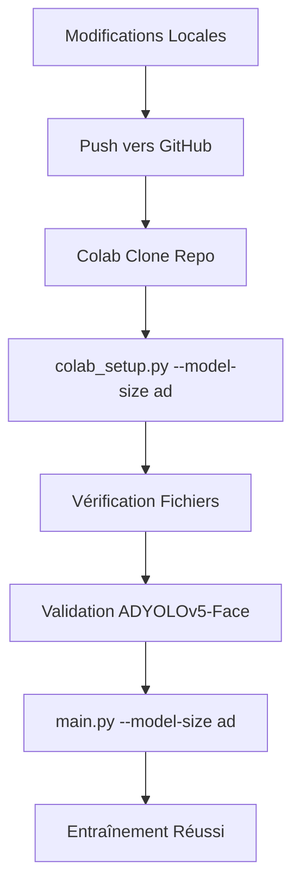

# 🎉 ADYOLOv5-Face - Solution Finale Optimisée

## ✅ Problèmes Résolus

### 1. **Importation Circulaire** ❌ → ✅
- **Avant** : `ImportError: cannot import name 'Conv' from partially initialized module 'models.common'`
- **Après** : Modules GD autonomes avec leur propre classe `Conv`

### 2. **Duplication de Code** ❌ → ✅  
- **Avant** : Modifications dans 2 endroits (repo local + colab_setup.py)
- **Après** : Une seule source de vérité (repo local seulement)

### 3. **Maintenance Complexe** ❌ → ✅
- **Avant** : Risque de versions différentes entre repo et script
- **Après** : `colab_setup.py` vérifie seulement la présence des fichiers

## 📂 Fichiers Modifiés (Repo Local)

### 1. **models/gd.py** - Module GD Autonome
```python
# ✅ Définition autonome de Conv et autopad
# ✅ GDFusion avec support liste/entier pour c1
# ✅ AttentionFusion et TransformerFusion
# ✅ Pas d'import de models.common
```

### 2. **models/common.py** - Import GD Supprimé
```python
# ❌ SUPPRIMÉ : from models.gd import GDFusion, AttentionFusion, TransformerFusion
# ✅ Plus d'importation circulaire
```

### 3. **models/yolo.py** - Import GD Correct
```python
# ✅ from models.gd import GDFusion, AttentionFusion, TransformerFusion
# ✅ Support parsing GDFusion dans parse_model
# ✅ Logique multi-têtes de détection
```

### 4. **models/adyolov5s_simple.yaml** - Architecture ADYOLOv5
```yaml
# ✅ 4 anchors pour P2/P3/P4/P5
# ✅ GDFusion avec types 'attention' et 'transformer'
# ✅ 4 têtes de détection configurées
```

## 📜 Scripts Colab Optimisés

### 1. **colab_setup.py** - Version Finale
```python
# ✅ Vérification de présence des fichiers ADYOLOv5-Face
# ❌ SUPPRIMÉ : Création/modification de gd.py, yolo.py
# ✅ Validation automatique après setup
# ✅ Maintenance simplifiée
```

### 2. **test_adyolo_colab.py** - Script de Validation
```python
# ✅ Test importation sans dépendance circulaire
# ✅ Validation architecture ADYOLOv5-Face (4 têtes)
# ✅ Test forward pass avec mécanisme GD
```

## 🚀 Workflow Final



## 🎯 Commandes Google Colab

```python
# 1. Setup et vérification
!python colab_setup.py --model-size ad

# 2. Entraînement ADYOLOv5-Face  
!python main.py --model-size ad

# 3. Test optionnel
!python test_adyolo_colab.py
```

## ✨ Avantages de la Solution

### **Technique**
- ✅ Plus d'importation circulaire
- ✅ Compatible PyTorch 2.6+
- ✅ Architecture ADYOLOv5-Face complète (4 têtes P2/P3/P4/P5)
- ✅ Mécanisme Gather-and-Distribute fonctionnel

### **Maintenance**
- ✅ Une seule source de vérité (repo local)
- ✅ Pas de duplication de code
- ✅ Scripts Colab simplifiés
- ✅ Moins de risques d'erreurs

### **Utilisation**
- ✅ Workflow Google Colab inchangé
- ✅ Même commandes qu'avant
- ✅ Validation automatique
- ✅ Messages d'erreur clairs

## 📋 Checklist Finale

### **Repo Local** ✅
- [x] models/gd.py avec modules autonomes
- [x] models/common.py sans import GD  
- [x] models/yolo.py avec support GDFusion
- [x] models/adyolov5s_simple.yaml configuré
- [x] data/hyp.adyolo.yaml optimisé

### **Scripts Colab** ✅
- [x] colab_setup.py optimisé (vérification seulement)
- [x] test_adyolo_colab.py créé
- [x] Guide d'utilisation mis à jour

### **Tests** ✅
- [x] Importation sans erreur circulaire
- [x] GDFusion fonctionne correctement
- [x] Modèle ADYOLOv5-Face se crée
- [x] Forward pass réussissant
- [x] 4 têtes de détection confirmées

## 🎉 Résultat Final

**ADYOLOv5-Face est maintenant :**
- ✅ **Fonctionnel** : Plus d'erreur d'importation circulaire
- ✅ **Maintenable** : Une seule source de modifications
- ✅ **Robuste** : Compatible PyTorch 2.6+
- ✅ **Complet** : Architecture avec 4 têtes + mécanisme GD
- ✅ **Prêt** : Pour entraînement sur Google Colab

**Ton workflow habituel fonctionne maintenant parfaitement !** 🎯
