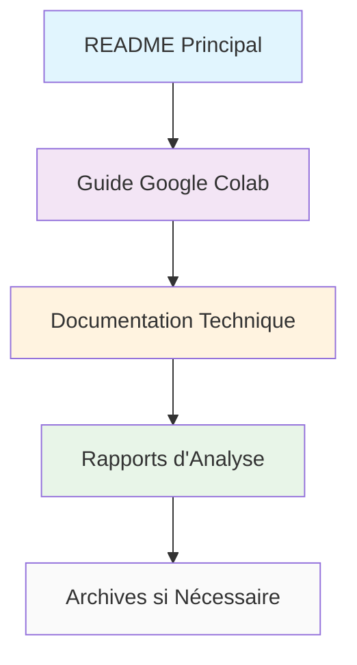

# 📚 Documentation YOLOv5-Face ADYOLOv5

Bienvenue dans la documentation complète du projet YOLOv5-Face ADYOLOv5. Cette documentation est organisée selon les bonnes pratiques pour faciliter la navigation et la maintenance.

## 📂 Structure de la Documentation

### 🎯 [Guides d'Utilisation](guides/)

Documentation pratique pour utiliser le projet :

- **[Guide Google Colab ADYOLOv5 V2](guides/GUIDE_COLAB_ADYOLO_V2.md)** ⭐
  - Workflow complet pour Google Colab
  - Configuration automatisée ADYOLOv5-Face
  - Entraînement optimisé pour petits visages

### 📊 [Rapports Techniques](reports/)

Analyses, résultats et études du projet :

- **[Rapport de Nettoyage](reports/RAPPORT_NETTOYAGE.md)**
  - Optimisation de la structure du projet
  - Suppression des fichiers obsolètes
  - Amélioration de la maintenance

### 🔧 [Documentation Technique](technical/)

Architecture, implémentation et solutions techniques :

- **[README ADYOLOv5](technical/README_ADYOLOv5.md)**
  - Architecture détaillée ADYOLOv5-Face
  - Mécanisme Gather-and-Distribute
  - Comparaison avec YOLOv5 standard

- **[Solution Finale ADYOLOv5](technical/SOLUTION_FINALE_ADYOLO.md)**
  - Implémentation complète
  - Résolution des problèmes techniques
  - Guide de développement avancé

### 📜 [Archive](archive/)

Anciennes versions et documentation historique :

- **[Instructions Simples ADYOLOv5](archive/ADYOLOV5_SIMPLE_INSTRUCTIONS.md)**
- **[Guide Colab Original](archive/GUIDE_COLAB_ADYOLO.md)**
- **[Notes de Finalisation](archive/FINALISATION.md)**

## 🚀 Démarrage Rapide

### Pour les Utilisateurs
1. 📖 Commencez par le **[Guide Google Colab](guides/GUIDE_COLAB_ADYOLO_V2.md)**
2. 🎯 Consultez le **[README principal](../README.md)** pour une vue d'ensemble

### Pour les Développeurs
1. 🔧 Explorez la **[Documentation Technique](technical/)**
2. 📊 Consultez les **[Rapports](reports/)** pour comprendre l'évolution du projet

## 📈 Progression Recommandée

## 🏷️ Conventions de Documentation

### Types de Documents

| Icône | Type | Description |
|-------|------|-------------|
| 🎯 | Guide | Instructions pratiques d'utilisation |
| 📊 | Rapport | Analyses et études techniques |
| 🔧 | Technique | Architecture et implémentation |
| 📜 | Archive | Documentation historique |

### Niveaux de Priorité

| Priorité | Indication | Public Cible |
|----------|------------|--------------|
| ⭐ | Essentiel | Tous les utilisateurs |
| 🔥 | Important | Utilisateurs avancés |
| 💡 | Utile | Développeurs |
| 📚 | Référence | Maintenance |

## 🛠️ Maintenance de la Documentation

### Règles d'Organisation

1. **Un fichier = Un sujet** : Chaque document traite d'un aspect spécifique
2. **Liens relatifs** : Utilisation de chemins relatifs pour la portabilité
3. **Structure cohérente** : Même organisation dans tous les documents
4. **Mise à jour régulière** : Documentation synchronisée avec le code

### Ajout de Nouvelle Documentation

Pour ajouter un nouveau document :

1. **Choisir la catégorie** appropriée (`guides/`, `reports/`, `technical/`, `archive/`)
2. **Suivre la convention** de nommage : `NOM_EXPLICITE.md`
3. **Mettre à jour** cet index avec le nouveau document
4. **Ajouter des liens** croisés si pertinent

## 📞 Contact et Contribution

- 🐛 **Issues** : Signalez les problèmes de documentation
- 🔄 **Pull Requests** : Contribuez aux améliorations
- 💬 **Discussions** : Proposez des améliorations

---

**💡 Cette documentation suit les bonnes pratiques d'organisation pour faciliter la navigation et la maintenance du projet.**
